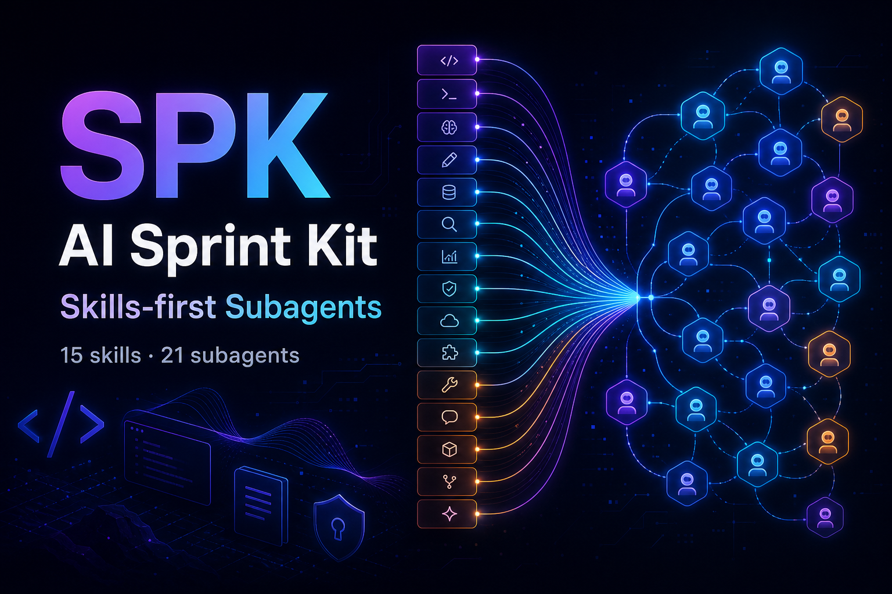

# AI Sprint Kit (SPK)



ระบบ skills & subagent development สำหรับ Claude Code ติดตั้งเป็น plugin - hot-reload ใน session ทันที ไม่ต้อง restart

**Positioning:** Skills-first Subagents - subagent ทำงานเก่งขึ้นเพราะมี reusable skills / playbooks ไม่ใช่แค่ prompt ยาว ๆ

> English version: [README-EN.md](./README-EN.md)

<!-- SPK-COUNTS:start -->
**21 subagents** (4 orchestrators + 17 specialists) · **15 skills**
<!-- SPK-COUNTS:end -->

## ติดตั้ง

```
/plugin marketplace add apipoj/spk
/plugin install spk@spk
```

เสร็จ Plugin hot-reload ให้เอง ไม่ต้อง restart `claude`

ครั้งต่อไปที่เริ่ม session ใหม่ SPK จะ scaffold `ai_context/wiki/` และ `ai_context/sources/` ใน project ของคุณอัตโนมัติ

ถ้าติดตั้งไว้แล้ว อัปเดตด้วย:

```text
/plugin update
```

Skills มี namespace `/spk:` ให้เอง - พิมพ์ `/spk:` แล้วจะเห็น `/spk:plan`, `/spk:code`, `/spk:review`, `/spk:bala`, `/spk:sunzi`, `/spk:design-shotgun`, `/spk:debug`, `/spk:deploy`, `/spk:pr`, `/spk:ingest`, `/spk:prime`, `/spk:query`, `/spk:wiki-lint`, `/spk:tdd`, `/spk:uninstall`

Subagents ก็ namespace `spk:` ให้เหมือนกัน: `spk:planner`, `spk:architect`, ฯลฯ

## Workflow Highlights

- `/spk:bala` ใช้หลักพละ 5 เป็น balance check ก่อน plan/code/review/debug: ศรัทธา วิริยะ สติ สมาธิ ปัญญา แปลงเป็น evidence, effort, context, focus, wisdom
- `/spk:sunzi` ใช้หลักซุนวูเป็น strategy lens ก่อนเลือก battle, architecture, rollout หรือ competitive move: รู้เรา รู้เขา เลือก terrain และหา smallest winning move
- `/spk:design-shotgun` ทำ visual brainstorm แบบ GStack: แตก 3+ design directions, ทำ comparison board, เก็บ feedback แล้วล็อก approved direction ก่อน `/spk:code`
- `/spk:debug` ใช้ตอน test fail / behavior เพี้ยน / error ไม่ชัด: ให้ `spk:debugger` ทำ root-cause analysis ก่อนเสนอ fix และต้องมี evidence + regression test recommendation
- `/spk:pr` ใช้เตรียม PR อย่างปลอดภัย: default เป็น prepare-only, ทำ PR body/checklist/safety report ก่อน และต้องขอ explicit confirmation ก่อน push หรือ `gh pr create/edit`
- `/spk:tdd` บังคับ RED-GREEN-REFACTOR: test ต้อง fail ก่อน implementation แล้วค่อย green/refactor
- Orchestrators ใช้ shared subagent contract: prompt ต้อง self-contained, parallel เฉพาะงานไม่ชนไฟล์, retry `BLOCKED` ได้หนึ่งครั้ง, และต้องผ่าน verifier gate ก่อนบอกว่า done

## Subagent Squad

<!-- SPK-AGENTS:start -->
| Name | Role | Model | Color | Phase |
|---|---|---|---|---|
| `plan-orchestrator` | orchestrator | claude-opus-4-7 | green | planning |
| `build-orchestrator` | orchestrator | claude-opus-4-7 | blue | building |
| `audit-orchestrator` | orchestrator | claude-opus-4-7 | purple | auditing |
| `deploy-orchestrator` | orchestrator | claude-opus-4-7 | orange | shipping |
| `prd-writer` | specialist | claude-opus-4-7 | green | planning |
| `business-analyst` | specialist | claude-opus-4-7 | green | planning |
| `architect` | specialist | claude-opus-4-7 | green | planning |
| `planner` | specialist | claude-opus-4-7 | green | planning |
| `designer` | specialist | claude-sonnet-4-6 | green | planning |
| `primer` | specialist | claude-sonnet-4-6 | green | planning |
| `debugger` | specialist | claude-opus-4-7 | purple | auditing |
| `code-auditor` | specialist | claude-opus-4-7 | purple | auditing |
| `implementer` | specialist | claude-sonnet-4-6 | blue | building |
| `tester` | specialist | claude-sonnet-4-6 | blue | building |
| `docs` | specialist | claude-sonnet-4-6 | blue | building |
| `researcher` | specialist | claude-sonnet-4-6 | blue | building |
| `verifier` | specialist | claude-sonnet-4-6 | purple | auditing |
| `pr-manager` | specialist | claude-sonnet-4-6 | orange | shipping |
| `devops` | specialist | claude-sonnet-4-6 | orange | shipping |
| `deployment-smoke` | specialist | claude-sonnet-4-6 | orange | shipping |
| `browser-tester` | specialist | claude-sonnet-4-6 | orange | shipping |
<!-- SPK-AGENTS:end -->

## Skills / Slash Commands

<!-- SPK-COMMANDS:start -->
| Skill | Dispatches to subagent |
|---|---|
| `/spk:plan` | plan-orchestrator |
| `/spk:code` | build-orchestrator |
| `/spk:review` | audit-orchestrator |
| `/spk:bala` | verifier |
| `/spk:sunzi` | planner |
| `/spk:design-shotgun` | designer |
| `/spk:debug` | debugger |
| `/spk:deploy` | deploy-orchestrator |
| `/spk:pr` | pr-manager |
| `/spk:ingest` | plan-orchestrator |
| `/spk:prime` | primer |
| `/spk:query` | researcher |
| `/spk:wiki-lint` | audit-orchestrator |
| `/spk:tdd` | build-orchestrator |
| `/spk:uninstall` | (no subagent) |
<!-- SPK-COMMANDS:end -->

## Memory

ทุก project ที่ติดตั้ง SPK จะได้ LLM-wiki สไตล์ Karpathy ที่ `ai_context/wiki/`:

- `sources/` - ไฟล์ raw ที่คุณ drop ลงมา ห้ามแก้ (immutable)
- `wiki/` - LLM เป็นคนดูแล page concept / entity / decision ข้ามโยงกันเอง
- `index.md` - catalog รวมทุก wiki page
- `log.md` - log แบบ append-only สำหรับ ingest / query / lint

Drop ไฟล์ลงใน `ai_context/sources/` แล้ว auto-ingest จะทำงานให้ ถาม `/spk:query "..."` แล้ว wiki จะตอบก่อนไปค้น web

## Security

ป้องกัน secrets ใน wiki 5 ชั้น:

1. ingest-time secret scan
2. pre-write fail-closed hook
3. lint-time audit
4. `ai_context/sources/` ถูก `.gitignore` by default
5. `.gitignore` respect ระหว่าง wiki-build

Secrets จะไม่หลุดเข้า wiki pages

## Native Skills (Thai, No Plugin)

ระบบ `skills/` ที่ root ของ repo มี native skill copies ภาษาไทยที่ทำงานได้โดยไม่ต้องติดตั้ง plugin เหมาะสำหรับผู้ที่ไม่ใช้ Claude Code plugin system หรือต้องการ skill playbooks แบบ self-contained

**วิธีใช้:** copy ทั้ง folder `skills/spk-<slug>/` เข้าไปที่ `.claude/skills/spk-<slug>/` ใน project ของคุณ หรือ `~/.claude/skills/spk-<slug>/` ถ้าต้องการใช้ทุก project เรียกใช้ด้วย `/spk-bala`, `/spk-code`, `/spk-plan` ฯลฯ

Native skills เขียนเป็นภาษาไทย มี prefix `spk-` และทำงานเป็น main-thread workflow โดยตรง ไม่ขึ้นกับ subagent หรือ plugin

**Skills ที่มี:**
- `/spk-bala` - ตรวจสอบสมดุลด้วยหลักพละ 5
- `/spk-code` - implement จาก plan แบบ TDD
- `/spk-debug` - root cause analysis อย่างเป็นระบบ
- `/spk-deploy` - deploy และ verify
- `/spk-design-shotgun` - visual brainstorm หลายทิศทาง
- `/spk-ingest` - นำ source เข้า wiki
- `/spk-plan` - วางแผน feature
- `/spk-pr` - เตรียม PR อย่างปลอดภัย
- `/spk-prime` - prime repo context
- `/spk-query` - Q&A แบบ wiki-first
- `/spk-review` - code review หลาย pass
- `/spk-sunzi` - strategy lens แบบซุนวู
- `/spk-tdd` - TDD loop แบบเข้มงวด
- `/spk-uninstall` - ถอน SPK ออก
- `/spk-wiki-lint` - ตรวจสอบสุขภาพ wiki

**ข้อแตกต่างจาก plugin skills:**
- เขียนเป็นภาษาไทย
- ไม่ต้องการ plugin install
- ไม่มี `Task()` dispatch ไปยัง subagent
- Workflow ทำงานบน main thread โดยตรง
- ไม่มี auto-scaffolding wiki/hooks

Plugin skills (`/spk:plan`, `/spk:code`, ฯลฯ) ยังคงทำงานเหมือนเดิมหลังติดตั้ง plugin - native skills เป็น alternative path เท่านั้น

ตรวจสอบ native skills: `npm run verify:native`

## Requirements

- Claude Code (subscription - Max หรือ Pro)
- Git
- Node.js 20+ (ใช้ตอน install เท่านั้น agent ไม่ใช้ runtime)

## License

MIT
